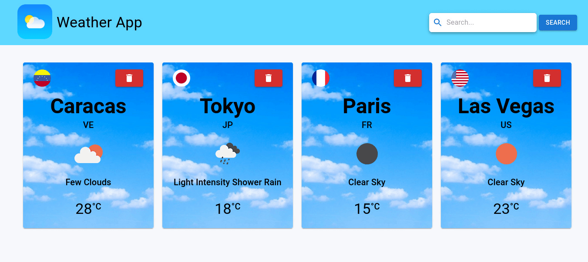

# Weather App Creada con React

Hola, bienvenidos al repositorio Weather App.

## Comenzando 🚀

Para hacerlo funcionar, te invito a clonar o forkear el repo. Una vez descargado, abre la terminal de comandos y ubicate en la carpeta del proyecto.

## Variables De Entorno ⚙️

Deberás ingresar a [Weather API](https://openweathermap.org/api), registrarte de forma gratuita y crear tu propio API key para poder realizar constulas, posteriormente vas a crear un archivo .env en la raiz del proyecto, dentro del mismo vas a crear una variable de entorno llamada REACT_APP_API_KEY y le vas a asignar el valor del Api key que acabas de obtener de la siguiente manera: REACT_APP_API_KEY="Your_Api_Key".

## Scripts Disponibles 📌

En el directorio del proyecto puedes ejecutar:

### `npm i ó npm install`
Para instalar todas las dependencias que requiere el proyecto para funcionar.

### `npm start`

Corre la aplicación en modo desarrollo un tu servidor local en tu computadora.
Abre [http://localhost:3000](http://localhost:3000) para verlo en el navegador.

### `npm run build`

Una vez realizado todos los cambios deseados con este comando crearas un bundle optimizado del proyecto listo para desplegar a producción.

## Despliegue 📦

Podrás visitar la aplicación en el siguiente [enlace](https://weather-app-dbriceno10.vercel.app/)

## Construido con 🛠️

HTML, CSS, JavaScript, TypeScript, React, Material-UI.

---
⌨️ con ❤️ por [dbriceno10](https://github.com/dbriceno10) 😊
