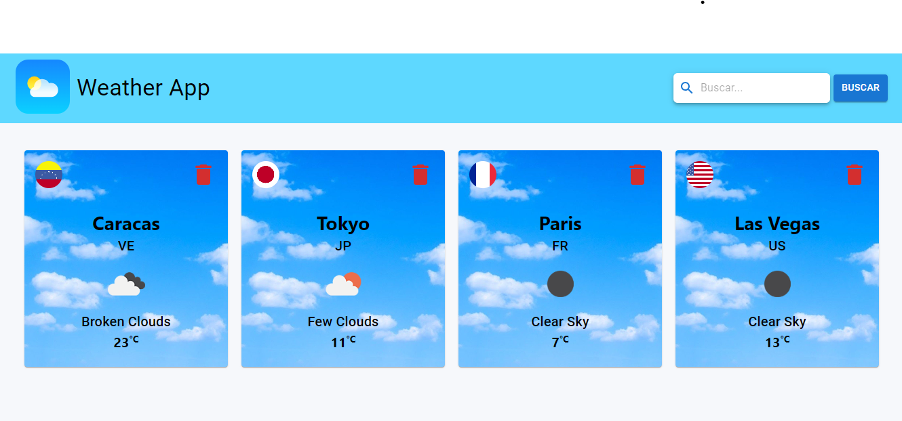

# Weather App Creada con React

Hola, bienvenidos al repositorio Weather App, la cual es una app para conocer el clima, el cuál se ha mejorado para guardar hasta 20 consultas, además de actualizar dichas consultas cada vez que se entra a la app y cada hora. El Fondo de las tarjetas cambiará dependiendo del momento del día.

## Comenzando 🚀

Para hacerlo funcionar, te invito a clonar o forkear el repo. Una vez descargado, abre la terminal de comandos y ubicate en la carpeta del proyecto.

## Variables De Entorno ⚙️

Deberás ingresar a [Weather API](https://openweathermap.org/api), registrarte de forma gratuita y crear tu propio API key para poder realizar constulas, posteriormente vas a crear un archivo .env en la raiz del proyecto, dentro del mismo vas a crear una variable de entorno llamada REACT_APP_API_KEY y le vas a asignar el valor del Api key que acabas de obtener de la siguiente manera: REACT_APP_API_KEY="Your_Api_Key", dentro del archivo .env.example encontraras las demás variables de entorno requeridas para levantar el proyecto, las cuales son las url de las apis necesarias.

## Scripts Disponibles 📌

En el directorio del proyecto puedes ejecutar:

### `npm i ó npm install`

Para instalar todas las dependencias que requiere el proyecto para funcionar.

### `npm start`

Corre la aplicación en modo desarrollo un tu servidor local en tu computadora.
Abre [http://localhost:3000](http://localhost:3000) para verlo en el navegador.

### `npm run build`

Una vez realizado todos los cambios deseados con este comando crearas un bundle optimizado del proyecto listo para desplegar a producción.

## Despliegue 📦

Podrás visitar la aplicación en el siguiente [enlace](https://weather-app-dbriceno10.vercel.app/)

## Construido con 🛠️

HTML, CSS, JavaScript, TypeScript, React, Material-UI.

---

⌨️ con ❤️ por [dbriceno10](https://github.com/dbriceno10) 😊
